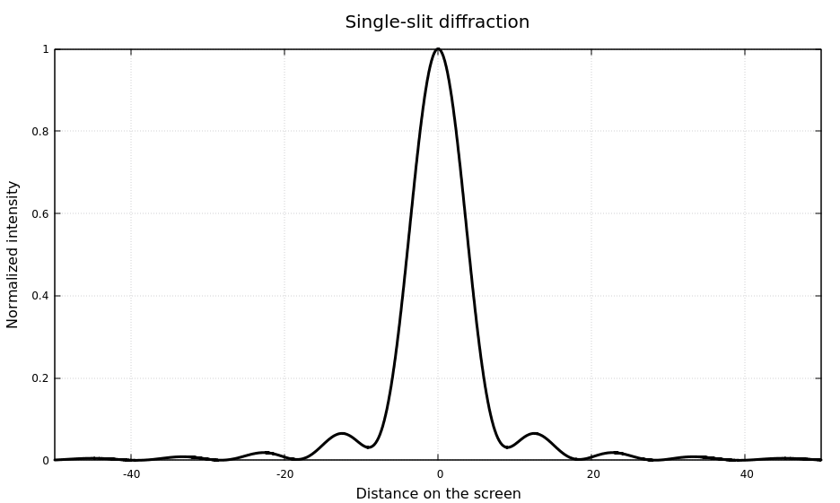
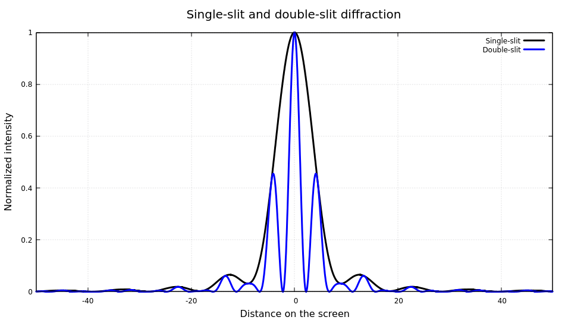
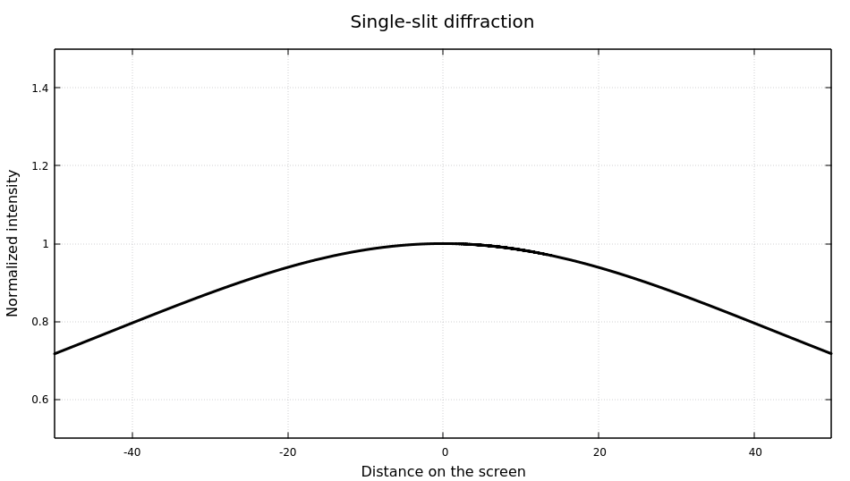

# Diffraction 
This project is a physical simulation of diffraction modeled in C++. Results plotted with gnuplot.

## Table of contents 
* [General info](#general-info)
* [Physics and numerical methods](#physics-and-numerical-methods)
* [Examples of use](#examples-of-use)
* [Setup](#setup)

## General info
The project allows to simulate single-slit and double-slit diffraction patterns for different physical conditions. The user can manipulate the initial parameters in the programm (e.g. the width of the slit, the wavelenght and the amplitude of the wave source), to observe the wave behaviour in different scenarios. Results - diffraction patterns, are represented as data files and can be viewed as graphs plotted with the programm of choice.

## Physics and numerical methods
The diffraction pattern made by waves passing through a slit can be understood with the [Huygens' Principle](https://en.wikipedia.org/wiki/Huygens%E2%80%93Fresnel_principle).

It states that:
> Every point on a wavefront is itself the source of spherical wavelets, and the secondary wavelets emanating from different points mutually interfere. The sum of these spherical wavelets forms a new wavefront.

The sum of waves propagating from all points on the aperture can be expressed as the diffraction integral. The solutions is then given by the numerical integration method called the [Simpson's rule](https://en.wikipedia.org/wiki/Simpson%27s_rule). 

## Examples of use

### Aperture width greater than the wavelength





### Aperture width smaller than the wavelength

 

### Aperture width greater than the wavelength


## Setup

To clone and run this code:
```
$ git clone https://github.com/juliakoban/Diffraction.git
$ cd Diffraction
$ g++ diffraction.cpp
```
To plot results with [gnuplot](http://www.gnuplot.info/) use one of the ".txt" plot setup files:

```
$ gnuplot
gnuplot> load "singleSlitPlot.txt"
```
